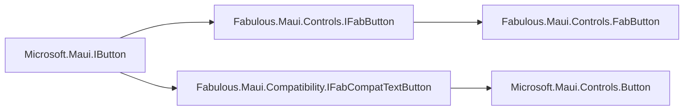

# Fabulous for .NET MAUI

[](https://github.com/fabulous-dev/Fabulous.Maui/actions/workflows/build.yml) [](https://www.nuget.org/packages/Fabulous.Maui) [](https://www.nuget.org/packages/Fabulous.Maui) [](https://discord.gg/bpTJMbSSYK) [](https://twitter.com/FabulousAppDev)

Fabulous.Maui brings the great development experience of Fabulous to .NET MAUI, allowing you to take advantage of the latest cross-platform UI framework from Microsoft with a tailored declarative UI DSL and clean architecture.

Deploy to any platform supported by .NET MAUI, such as Android, iOS, macOS, Windows, Linux and more!

```fs
/// A simple Counter app

type Model =
    { Count: int }

type Msg =
    | Increment
    | Decrement

let init () =
    { Count = 0 }

let update msg model =
    match msg with
    | Increment -> { model with Count = model.Count + 1 }
    | Decrement -> { model with Count = model.Count - 1 }

let view model =
    Application() {
        Window(
            VStack(spacing = 16.) {
                Image(Aspect.AspectFit, "fabulous.png")

                Label($"Count is {model.Count}")

                TextButton("Increment", Increment)
                TextButton("Decrement", Decrement)
            }
        )
    }
```

## Getting Started

You can start your new Fabulous.Maui app in a matter of seconds using the dotnet CLI templates.  
For a starter guide see our [Get Started with Fabulous.Maui](https://fabulous.dev/maui/get-started).

```sh
dotnet new install Fabulous.Maui.Templates
dotnet new fabulous-maui -n MyApp
```

## Documentation

The full documentation for Fabulous.Maui can be found at [docs.fabulous.dev/v2/maui](https://docs.fabulous.dev/v2/maui).

Other useful links:
- [The official Fabulous website](https://fabulous.dev)
- [Get started](https://fabulous.dev/maui/get-started)
- [API Reference](https://api.fabulous.dev/v2/maui)
- [Contributor Guide](CONTRIBUTING.md)

Additionally, we have the [Fabulous Discord server](https://discord.gg/bpTJMbSSYK) where you can ask any of your Fabulous related questions.

## Supporting Fabulous

The simplest way to show us your support is by giving this project and the [Fabulous project](https://github.com/fabulous-dev/Fabulous) a star.

You can also support us by becoming our sponsor on the GitHub Sponsors program.  
This is a fantastic way to support all the efforts going into making Fabulous the best declarative UI framework for dotnet.

If you need support see Commercial Support section below.

## Contributing

Have you found a bug or have a suggestion of how to enhance Fabulous? Open an issue and we will take a look at it as soon as possible.

Do you want to contribute with a PR? PRs are always welcome, just make sure to create it from the correct branch (main) and follow the [Contributor Guide](CONTRIBUTING.md).

For bigger changes, or if in doubt, make sure to talk about your contribution to the team. Either via an issue, GitHub discussion, or reach out to the team either using the [Discord server](https://discord.gg/bpTJMbSSYK).

## Commercial support

If you would like us to provide you with:

- training and workshops,
- support services,
- and consulting services.

Feel free to contact us: [support@fabulous.dev](mailto:support@fabulous.dev)

## Dev notes

.NET MAUI is still transitioning from the old architecture to the new one, so we need to use a hybrid approach to support both.

The `Core` folder contains the widgets and modifiers targeting the new architecture.  
The `Compatibility` folder contains the widgets and modifiers targeting the old architecture.

When MAUI migrates a control to the new architecture, we will need to remove the old widget from `Compatibility` and add the new one to `Core`.

To allow to use both old and new widgets in a same app, we rely on marker interfaces to ensure compatibility:
- `Microsoft.Maui.IButton` are the marker interfaces from the new architecture in .NET MAUI. They are also the base marker interfaces for Core and Compatibility widgets.
- `Fabulous.Maui.IFabButton` are marker interfaces for Core widgets.
- `Fabulous.Maui.Compatibility.IFabCompatButton` are marker interfaces for Compatibility widgets.



You need to make sure to apply the right kind of marker interfaces to avoid casting errors.  
All modifiers need to target only the corresponding marker interfaces as they directly cast to the underlying type, which will be different between old and new architecture.

On the other hand, to enable mixing old and new widgets in a same tree, all "children" modifiers (such as `Layout.Children`, `ContentView.Content`, etc) need to target the base marker interfaces (from `Microsoft.Maui`). e.g.
```fs
// Here, the children marker interface is Microsoft.Maui.IView
// Like this, we can pass either a Core or Compatibility widget as a child
 static member inline VStack<'msg>(?spacing: float) =
    CollectionBuilder<'msg, IFabCompatVerticalStackLayout, IView>(VerticalStackLayout.WidgetKey, LayoutOfView.Children)

// This textColor modifier actually relies on BindableProperty, so we need to make sure to target only the Compatibility marker interface Fabulous.Maui.Compatibility.IFabCompatButton
static member inline textColor(this: WidgetBuilder<'msg, #IFabCompatButton>, light: FabColor, ?dark: FabColor) =
    this.AddScalar(Button.TextColor.WithValue(AppTheme.create light dark))
```
